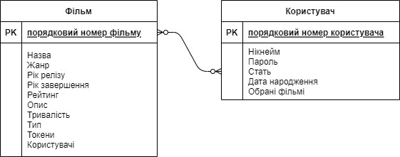
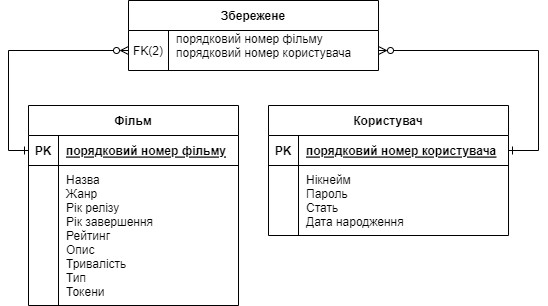
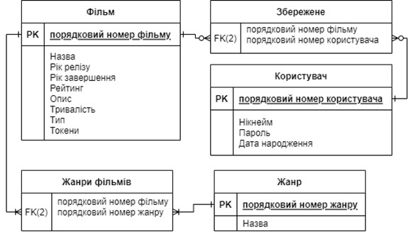
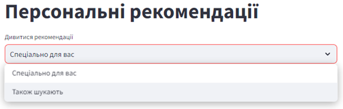

# :movie_camera: Рекомендаційний модуль фільмів та серіалів

Зміст:
1. [Опис](#description)
2. [Визначення методів створення рекомендаційного контенту](#methods)
3. [Розробка](#technical-realization)
    + [Проектування бази даних](#database-design)
    + [Створення та наповнення бази даних](#database-creation)
    + [Токенізація](#tokens)
    + [Інтелектуальний модуль](#module)
4. [Демо відео](#video)
5. [Додаткова інформація](#info)

> [!NOTE]
> Цей проект не є готовим рішенням, що враховує усі нюанси процесу створення та підтримки подібного роду платформ. Він відображає лише ключові кроки розробки та може слугувати базою для подальшого розвитку.

---
## :memo: <span id="description" >1. Опис</span>
Модуль дозволяє користувачу отримувати персональні рекомендації для перегляду фільмів і серіалів на основі вподобаного ним контенту та дій користувачів із подібними смаками.

---

## :thought_balloon: <span id="methods" >2. Визначення методів створення рекомендаційного контенту</span>

Для інтелектуального модуля буде створена __гібридна система надання рекомендацій__ — вона об'єднує кілька різних методів для покращення точності та ефективності пропозицій. Зокрема ми застосуємо такі види методів:

- __Контентна фільтрація__: використовує властивості предметів (наприклад, жанр, автор, рік випуску) для створення рекомендацій на основі того, що користувачеві вже сподобалося.
- __Колаборативна фільтрація__: рекомендує предмети, які схожі на ті, що вподобали інші користувачі зі схожими вподобаннями.

### 2.1.	Контентна фільтрація із використанням методу Жаккара.

Отож, для контентної фільтрації нам потрібно вибрати ознаки, за якими відбуватиметься створення рекомендацій, опираючись на вподобане користувача. Детальніше про інформацію, що зберігатиметься у базі даних можна подивитися у пункті [Проектування бази даних](#database-design), але загалом цілком логічно припустити, що у нас точно будуть наявними такі поля:

- _Жанри_
- _Роки_
- _Тип_: серіал чи фільм

Для реалізації цього завдання застосуємо __алгоритм Жаккара__. Основною _перевагою_ є його здатність ефективно обробляти великі датасети. Метод є частим вибором для подібних завдань у контексті рекомендаційних систем.

#### 2.1.1. Опис методу схожості Жаккара

Спочатку потрібно зрозуміти, як представляються дані: кожен об'єкт подається у вигляді _множини унікальних елементів_ (наприклад, для користувача це можуть бути жанри фільмів, які він переглядав). Міра схожості визначається як _кількість спільних елементів поділена на кількість унікальних елементів у множинах_, тобто _частка при діленні перетину на об’єднання множин_. 

__Формула__ для обрахунку:

$J(A,B) $= $\frac{|A \cap B|}{|A \cup B|}$

де A, B – множини. Коефіцієнт може знаходитися у межах від 0 до 1.

Визначивши ступінь схожості, можна відфільтрувати дані для конкретних запитів.

#### 2.1.2. Адаптація методу під дану рекомендаційну систему

У контексті даного завдання, метод Жаккара буде використовуватися для __фільтрації по жанрам__. Наприклад, нехай ми хочемо знайти фільми за такми жанрами: комедія, трилер, детектив, сімейне, мюзикл – це множина A. з нею буде порівнюватися фільм, що має такі жанри: трилер, детектив, драма – множина B. Тобто ми отримаємо:
A = { комедія, трилер, детектив, сімейне, мюзикл }, B = { трилер, детектив, драма }...

Також буде потрібно __фільтрувати дані за роком та типом__, але у цьому випадку легше – рік чи тип можна представити як множину з одного об’єкта, тобто для фільтрації залишиться перевірити, чи знаходиться властивість досліджуваного об’єкта в множині, по якій потрібно зробити фільтрацію.

### 2.2.	Колаборативна фільтрація на основі кластеризації даних із використанням методу K-середніх.

#### 2.2.1. Особливості, переваги та недоліки 	

Алгоритм працює шляхом випадкового вибору `K` початкових центрів кластерів, потім ітеративно призначає кожну точку даних до найближчого центру і обчислює нові центри до тих пір, поки вони не стабілізуються.

_Переваги:_

- не є складним у реалізації
- має гарні показники як для великих, так і для малих вибірок
- має досить високу швидкодію
- має лінійну складність O(n). 

_Недоліки:_ 
- є досить чутливим до викидів
- необхідно самому вибрати кількість кластерів (`K`), що не є тривіальною задачею.

> [!NOTE]
> Наперед обране оптимальне значення `K` потрібно заново обраховувати кожного при змінах вподобань користувача і збільшення користувацької бази загалом. 
>
> Набагато краще для таких потреб підходить алгоритм `OPTICS`([sklearn OPTICS](https://scikit-learn.org/stable/modules/generated/sklearn.cluster.OPTICS.html)) - він визначає кількість кластерів самостійно, має гнучке налаштування параметрів при групуванні точок у кластери різної щільності та може бути застосований у випадках, коли потрібно враховувати частоту зустрічання контенту. 
>
> Детально його роботу на прикладі було описано в проекті [Musua](https://github.com/anastasya-kl/musua) - це мобільний музичний додаток, який також надає рекомендації на основі гібридної системи, але з використанням `OPTICS`.

#### 2.2.2. Метод Ліктя

Розглянемо спосіб визначення кількості початкових кластерів на основі __методу «Ліктя»__. Алгоритм роботи:
1)	__Проводимо кластеризацію__ методом `K-середніх` для різної кількості кластерів – від `1` до певного `n`
2)	__Обчислення інерції__: вона представляє собою суму квадратів відстаней від кожної точки до центра свого кластера.
3)	__Побудова графіка__: створюється графік, на якому по осі X відкладена кількість кластерів, а по осі Y — відповідна інерція.
4)	__Аналіз графіка__: шукається точка, де спостерігається зниження темпу зміни інерції. Ця точка називається _«Elbow»_ або _«лікоть»_.
5)	__Визначення оптимальної кількості кластерів__: визначається як кількість, при якій спостерігається досить різке зниження інерції, при чому подальше зниження стає менш виразним.

Розглянемо __переваги__ такого методу: 
- є простим та зрозумілим у використанні
- ефективно визначає кількість кластерів
- може допомогти визначити загальну структуру даних для подальшого аналізу

Тепер про __недоліки__:
- не у всіх випадках можна замітити чіткий лікоть
- саме визначення "Ліктя" мало би відбуватися кимось, хто аналізує графік, але ми застосуємо алгоритми машинного навчання для його пошуку
- якщо дані мають дуже велику варіативність, це може привести до нестабільності результатів
- попередньо потрібно обмежити кількість використовуваних кластерів, а це значення також має бути оптимальним

---

## :computer: <span id="technical-realization">3. Розробка</span>

База даних додатку була розроблена локально з використанням `Sqlite` - легковагого, вбудованого SQL-двигуна, який не вимагає налаштування сервера і чудово підходить для додатків з невеликим або середнім обсягом даних.

Самі `frontend` та `backend` частини були розроблені на `Python` із використанням `Streamlit` — фреймворку, що дозволяє швидко створювати інтерактивні веб-застосунки для аналізу даних та машинного навчання без необхідності складного налаштування.

---

### <span id="database-design">3.1. Проектування бази даних</span>

#### 3.1.1. Визначення типу БД; основні поняття; завдання при проектуванні БД
>Для проектування БД будемо використовувати __реляційну модель__ – вона дозволяє встановлювати зв'язки між різними наборами інформації та використовувати їх для управління і отримання пов'язаних даних. Ця модель розглядає таблиці у ролі _сутностей_. Кожна табличка має стовпці – _атрибути, поля_ – що є певною властивістю об’єкта  та рядки – _записи, кортежі_ – які характеризують окремий об’єкт. Така модель є найбільш прийнятою у більшості випадках.

Основні поняття, що є ключовими при проектуванні такої БД:
- __Сутність__: це об’єкт реального світу, який має відповідні атрибути.
- __Зв’язок__: це взаємодія між сутностями. _Види зв’язків_: 
  - «Один до одного» (1:1): одному екземпляру сутності може відповідати тільки один екземпляр іншої сутності; 
  - «Один до багатьох» (1:M): одному екземпляру сутності може відповідати 0, 1 або більше екземплярів іншої сутності; 
  - «Багато до багатьох» (M:N): декільком екземплярам однієї сутності може відповідати декілька екземплярів іншої сутності
- __Концептуальне проектування__: Це процес розробки концептуальної моделі предметної області (ПО), мета якого визначити основні сутності, зв’язки не опираючись на конкретну СУБД.
- __Логічне проектування__: Це створення схеми БД на основі конкретної моделі даних, наприклад, реляційної моделі БД.
- __Нормалізація__: Це процес приведення таблиць БД до ряду нормальних форм з метою уникнення надлишковості в базі даних, аномалій вставки, редагування та видалення даних.
- __ER-модель__: Це модель даних, яка дозволяє описувати концептуальні схеми ПО. ER-модель використовується при високорівневому (концептуальному) проектуванні баз даних.

У ході проектування структури таблиць БД будуть виконаними такі _завдання_:
- Аналіз ПО з точки зору розробки БД: мета, вимоги, задачі, зв’язки між сутностями.
- Концептуальне проектування
- Логічне проектування
- Нормалізація таблиць
- Обмеження цілісності
- Розробка логічної ER-моделі

#### 3.1.2. Аналіз предметної області з точки зору розробки БД
__Мета__ створення БД:
- Управління контентом: БД слугуватиме централізованим місцем для зберігання і управління інформацією про фільми
- Аналіз даних: БД потрібна для аналізу взаємозв’язки між користувачами та фільмами
- Відстеження взаємодії користувачів

__Сутності__: фільм, користувач
__Зв’язки__ сутностей:
- Користувач може зберегти безліч фільмів в «обране»
- Кожен фільм може бути збережений у багатьох користувачів

__Вимоги__:
- Якщо користувач зберіг певний набір фільмів, має бути можливість відобразити цей список та відповідну інформацію
- Користувач може дізнаватися інформацію про фільми, але не може зберігати їх у випадку незареєстрованого акаунта

__Задачі__:
- додавати (реєструвати) нові фільми;
- редагувати інформацію про фільми;
- сортувати та здійснювати пошук фільмів за жанрами, роком, типом, назвами, рейтингом;
- аналіз активності користувача;
- створення акаунта користувача
- формування збережених фільмів користувача

#### 3.1.3. Концептуальне проектування
Атрибути, Первинний ключ сутності «Фільм»
<table>
  <tr>
    <th>Сутність</th>
    <th>Атрибути</th>
    <th>Первинний ключ</th>
  </tr>
  <tr>
    <td rowspan="11" style="vertical-align: middle;">Фільм</td>
    <td>Порядковий номер фільму</td>
    <td rowspan="11" style="vertical-align: middle;">Порядковий номер фільму</td>
  </tr>
  <tr>
    <td>Назва</td>
  </tr>
  <tr>
    <td>Жанр</td>
  </tr>
  <tr>
    <td>Рік релізу</td>
  </tr>
  <tr>
    <td>Рік завершення</td>
  </tr>
  <tr>
    <td>Рейтинг</td>
  </tr>
  <tr>
    <td>Опис</td>
  </tr>
  <tr>
    <td>Тривалість</td>
  </tr>
  <tr>
    <td>Тип</td>
  </tr>
  <tr>
    <td>Токени</td>
  </tr>
  <tr>
    <td>Користувачі</td>
  </tr>
</table>

Атрибути, Первинний ключ сутності «Користувач»
<table>
  <tr>
    <th>Сутність</th>
    <th>Атрибути</th>
    <th>Первинний ключ</th>
  </tr>
  <tr>
    <td rowspan="11" style="vertical-align: middle;">Фільм</td>
    <td>Порядковий номер користувача</td>
    <td rowspan="11" style="vertical-align: middle;">Порядковий номер користувача</td>
  <tr>
    <td>Нікнейм</td>
  </tr>
  <tr>
    <td>Пароль</td>
  </tr>
  <tr>
    <td>Дата народження</td>
  </tr>
  <tr>
    <td>Стать</td>
  </tr>
  <tr>
    <td>Обрані фільмі</td>
  </tr>
</table>



Тут `PK (Primary Key)` – це унікальне значення, що певним чином ідентифікуватиме кожен запис у таблиці. Також його завданнями є:
- Уникнення дублювання значень для ключових атрибутів сутностей
- Можливість швидко і зручного сортування
- Оптимізація швидкодії роботи із записами (кортежами)
- Організація оптимальних зв’язків між таблиці, подолання зв’язків виду багато до багатьох»
- Приведення усіх таблиць до нормальних форм

#### 3.1.4. Логічне проектування
##### Усунення зв’язків «N:M» (багато до багатьох)

На етапі логічного проектування відбуваєтьсяс процес перетворення зв'язків `«N:M» (багато до багатьох)` до виду `«1:1» (один до одного)` чи `«1:M» (один до багатьох)` для усунення надлишковості даних. Для її усунення ми будемо використовувати проміжну таблицю – містить дані, що встановлюють взаємозв'язок між записами цих двох таблиць. У цьому випадку також використовуються `Foreign Key (FK)` – зовнішній ключ – потрібен для встановлення зв'язків між відношеннями (таблицями). Поширеною практикою є використання `PK сутностей`, між якими потрібно подолати зв’язок `«багато до багатьох»`.

Створимо додаткову таблицю `«Збережене»`, що буде складатися із унікальних ідентифікаторів (ключів) сутностей `«Фільм»` і `«Користувач»`.



Тепер для усіх таблиць наявні лише сутності `«1:M»`:
- один користувач може мати багато збережень, але одне збереження може відповідати лише одному користувачу; 
- один фільм може бути у збережених в багатьох користувачів, але одне збереження відповідає лише одному фільму.

##### Нормалізація
Ще один процес, який відбувається на етапі логічного проектування – ___нормалізація___ – приведення таблиць до нормальних форм (НФ). Існують такі НФ:
1)	`Перша НФ` – усі атрибути є _атомарними_, тобто простими, такими, що їх неможливо (або просто не потрібно) ділити на інші.
2)	`Друга НФ` – усі непервинні атрибути _функціонально повно залежать_ від відповідних первинних ключів. Ця умова вже може автоматично виконатися, якщо наші первинні ключі не є складеними.
3)	`Третя НФ` – у всіх таблицях кожен непервинний атрибут не є транзитивно залежним від первинного ключа. _Транзитивність_ можна описати так: якщо A залежить від B, а B залежить від C, то A транзитивно залежить від C.


Розглянемо атрибути сутності `«Користувач»`:
- `Порядковий номер` є атомарним атрибутом (АА)
- `Нікнейм` є АА
- `Пароль` є АА
- `Стать` є АА
- `Дата народження` (ДН) може виступати як складений атрибут. У даному випадку ДН зберігатиметься як тип даних Date і буде необхідним лише для обчислення віку людини на основі цих даних, тому немає змісту розбивати цей атрибут на менші. Отже, властивість ДН також є атомарною

> Висновок: таблиця `«Користувач»` знаходиться у першій НФ.

Аналогічно проаналізуємо сутність `«Фільм»`:
- `Порядковий номер` є АА
- `Назва` є АА
- `Жанр` не є АА, оскільки фільм може мати декілька жанрів. Щоб подолати це, у даному випадку, можна створити такі додаткові таблиці: табл. «Жанр» та «Жанри фільмів»
- `Рік релізу/завершення` є АА
- `Опис` є АА
- `Тривалість` могла би бути складеним атрибутом, але тут вона зберігатиметься у хвилинах, тому це АА
- `Рейтинг` біг би бути складеним атрибутом, але тут враховутимуться рейтинги лише системи IMDb, тому це АА
- `Тип` є АА
- `Токени` не є АА, але в даному випадку їх зручно зберігати у вигляді рядка, розділеного пропусками, тому будемо враховувати, що властивість є АА

> Отже, для сутності «Фільм» необхідно вирішити проблему атомарності для властивості Жанр. 

Як було згадано вище, ми створимо дві таблички:

- Таблиця `«Жанр»` міститиме два стовпці: ідентифікатор-ключ та назву. Фактично, назва жанру також виступатиме унікальним атрибутом, тобто вона могла би бути ключем у наступній таблиці і можна було би обійтися без створення цієї додаткової, але завжди гарною практикою є присвоєння чисельних ключів для їх більш швидкого пошуку, сортування і порівняння у ході проведення запитів до БД
- Таблиця `«Жанри фільмів»` міститиме два стовпці: код фільму та код жанру. Обидва атрибути є `FK` і посилатимуться на відповідні зовнішні таблиці

Сутність `«Збережене»` має лише АА, оскільки вони є `FK`.

> Після приведенення таблиць до першої НФ також робимо висновок, що усі таблиці вже знаходяться у другій та третій НФ, а отже, можна привести вигляд логічної ER-моделі



##### Обмеження цілісності

Таблиця `«Користувач»`:
- Порядковий номер користувача: INT, PK, UNSIGNED, UNIQUE, AUTO INCREMENT, NOT NULL
- Нікнейм: TEXT, UNIQUE, NOT NULL
- Пароль: TEXT, NOT NULL
- Стать: TEXT, NOT NULL
- Дата народження:  DATE, NOT NULL

Таблиця `«фільм»`:
- Порядковий номер фільму: INT, PK, UNSIGNED, UNIQUE, AUTO INCREMENT, NOT NULL
- Назва; TEXT, NOT NULL
- Рік релізу: INT, NOT NULL
- Рік завершення: INT
- Рейтинг: FLOAT, NOT NULL
- Опис: TEXT
- Тривалість: INT
- Тип: TEXT, NOT NULL
- Токени, TEXT, NOT NULL

Таблиця `«Обрані фільмі»`:
- Порядковий номер фільму: INT, FK, UNSIGNED, NOT NULL
- Порядковий номер користувача: INT, FK, UNSIGNED, NOT NULL

Таблиця `«Жанр»`:
- Порядковий номер жанру: INT, PK, UNSIGNED, UNIQUE, AUTO INCREMENT, NOT NULL
- Назва: TEXT, UNIQUE, NOT NULL

Таблиця `«Жанри фільмів»`:
- Порядковий номер фільму: INT, FK, UNSIGNED, NOT NULL
- Порядковий номер жанру: INT, FK, UNSIGNED, NOT NULL

### <span id="database-creation">3.2. Створення та наповнення бази даних</span>

> Мета збору даних для рекомендаційного модуля фільмів і серіалів полягає в отриманні відповідної інформації, яка допоможе системі робити точні та персоналізовані рекомендації для користувачів. 
>
> Ми використаємо дані з `IMDb`, оскільки цей веб-сайт є одним з найбільших джерел інформації про фільми та серіали, включаючи деталі про жанри, акторів, рейтинги, відгуки користувачів тощо. 

#### 3.2.1. Аналіз веб-сторінки IMDb

Перш ніж парсити дані самого кіно, краще отримати загальний список посилань на їх контент. Це стає проблемою №1 - під час аналізу можливих рішень було виокремлено два підходи до вирішення цього завдання: знайти закономірність у формуванні посилань або ж витягнути ці посилання із атрибута `href` тегу `<a></a>.` Однозначної закономірності у формуванні посилань виявити нам не вдасться, проте другий варіант підходить ідеально.

- https://m.imdb.com/search/title/?explore=genres&title_type=feature посилання на ___фільми___
- https://m.imdb.com/search/title/?explore=genres&title_type=tv_series,tv_miniseries посилання на ___серіали___

Отож, ми маємо такого виду сторінки:


Певну інформацію можна витягнути прямо із цього вікна - назву, рейтинг, короткий опис... Але нам потрібно більше деталей.

Відкриємо панель розробника (_Developer Tools_):
- `Ctrl + Shift + I` (`Cmd + Option + I`) або `Ctrl + Shift + C` (`Cmd + Shift + C`)
або
- `Права кнопка миші` на елементі сторінки, опція `"Inspect"` чи `"Inspect Element"`.


Тут ми можемо побачити тег `<a></a>` і його атрибут `href` із відповідним посиланням на контент. Перейдемо за ним: https://m.imdb.com/title/tt1190634/?ref_=sr_i_1:


За відповідними посиланнями ми отримуємо можливість витягнути детальну інформацію по кожному фільму/серіалу.

#### 3.2.2. Парсинг даних та їх запис у базу даних

##### Інсталювання бібліотек

```python
# --------- import modules ---------
from bs4 import BeautifulSoup   
from selenium import webdriver
from selenium.webdriver.common.by import By
from selenium.webdriver.chrome.options import Options
from selenium.webdriver.support.ui import WebDriverWait
from selenium.webdriver.support import expected_conditions as EC
from selenium.webdriver.common.action_chains import ActionChains
import time
import re
import datetime
```

- `BeautifulSoup` — це бібліотека на `Python`, яка використовується для __парсингу__ `HTML` та `XML` документів. Працює безпосередньо з HTML-кодом, який вже був завантажений в іншу програму, таку як `requests`. Швидший для парсингу HTML, оскільки ___не потребує відкриття браузера___.
- `Selenium` — використовується для автоматизації веб-браузерів і тестування веб-застосунків.  
  - Відкриває реальний браузер (наприклад, Chrome, Firefox) і взаємодіє з ним так, як це робив би користувач. 
  - Повільніший, оскільки вимагає запуску і взаємодії з повноцінним браузером. 
  - Може взаємодіяти з динамічним контентом, заповнювати форми, клікати на кнопки, скролити сторінку і виконувати інші дії в браузері.

Як ви вже могли здогадатися, для парсингу нам знадобляться обидві бібліотеки. 

##### Парсинг посилань

Поглянемо ще раз на сторінку https://m.imdb.com/search/title/?explore=genres&title_type=feature:


Тут ми бачимо кнопку `50 more`, яка прогружає контент далі. Саме для імітування цього кліку у браузері нам і знадобиться `Selenium`. Для інших дій використаємо звичайний, легкий і швидкодіючий `BeautifulSoup`.

> [!NOTE]
> Ще один нюанс, на який варто звернути увагу, є жанрові категорії - зараз ми розглядали загальну сторінку фільмів, де вони сортуються за певними критеріями. Припустимо, було спарсино 500 одиниць даних і певного жанру там виявилося дуже мало. У такому випадку може бути доречним, наприклад, отримання посилань на окремі жанри і далі їх парсинг, що вже більшою мірою гарантує багате різноманіття усього виду контенту. Але, наврядчи, якщо у планах стоїть створення великої бази даних (наприклад, в декілька тисяч записів) у підсумку отримається катастрофічно недостатня кількість контенту певного жанру.

Отож, наші посилання на контент:

```python
movies_url = "https://m.imdb.com/search/title/?explore=genres&title_type=feature"
series_url = "https://m.imdb.com/search/title/?explore=genres&title_type=tv_series,tv_miniseries"
```

Далі потрібно виконати такі кроки:
1. відкрити браузер (у нас це буде `Chrome`)
2. проскролити в низ сторінки
3. клікнути на кнопку `50 more`
4. виконати кроки 2-3 бажану кількість разів
5. зібрати посилання на контент з атрибута `href` тегу `<a></a>`


> [!WARNING]
> Може виникнути __проблема у сумісності версій__, наприклад, версія Chrome на момент парсингу даних (11.2023-12.2023) – `120.0.6099.71`, в той час як для Chrome webdriver – `114.0.5735.90`. Через це __код не працюватиме__ і прийдеться скинути на певний час __версію Chrome__ та відключити автоматичне оновлення, що може бути незручним. 
>
> Також помилки у роботі можуть виникнути під час спроб кліку на кнопку – потрібно, щоб елемент знаходився у зоні видимості.
>
> Ще необхідно прорахувати швидкість загрузки додаткового контенту – можуть бути відставання у відображенні додаткових даних після кліку. У такому випадку потрібно грамотно продумати, після яких взаємодій є потреба дочекатися появи відповідних елементів.

```python
# Константи для часто використовуваних селекторів
SHOW_MORE_XPATH = '//button[contains(@class, "ipc-see-more__button")]'
FILM_LINK_CLASS = 'ipc-title-link-wrapper'
```

```python
def scroll_and_click(driver, i):
    """
    Функція для прокрутки сторінки та кліку на кнопку "Show more"
    
    :param driver: екземпляр веб-драйвера
    :param i: індекс для визначення, до якого елемента прокручувати
    """
    try:
        # Знаходимо елемент для прокрутки
        point = driver.find_element(By.XPATH, f'//li[{i*50}]//a[contains(@class, "ipc-title-link-wrapper")]')
        # Прокручуємо до цього елемента
        driver.execute_script("arguments[0].scrollIntoView()", point)
        time.sleep(5)
        
        # Чекаємо, поки кнопка "Show more" стане клікабельною
        show_more_button = WebDriverWait(driver, 30).until(
            EC.element_to_be_clickable((By.XPATH, SHOW_MORE_XPATH)))
        # Клікаємо на кнопку
        ActionChains(driver).move_to_element(show_more_button).click().perform()
        time.sleep(10)
    except Exception as e:
        print(f"Помилка при прокрутці та кліку: {e}")
```

```python
def createLinks(url):
    """
    Основна функція для створення списку посилань на фільми
    
    :param url: URL сторінки для обробки
    :return: список посилань на фільми
    """
    driver = None
    try:
        # Ініціалізуємо веб-драйвер і відкриваємо сторінку
        driver = webdriver.Chrome()
        driver.get(url)

        # Виконуємо прокрутку та клік 6 разів
        for i in range(1, 7):
            scroll_and_click(driver, i)

        # Фінальна прокрутка
        scroll_and_click(driver, 7)

        # Збираємо всі посилання на фільми
        return [a.get_attribute('href') for a in driver.find_elements(By.CLASS_NAME, FILM_LINK_CLASS)]

    except Exception as e:
        print(f"Загальна помилка в createLinks: {e}")
        return []

    finally:
        # Закриваємо драйвер, якщо він був створений
        if driver:
            driver.quit()
```

> [!NOTE]
> Тут вказано ```EC.element_to_be_clickable```, тобто дочекатися, поки елемент стане клікабельним, проте на практиці це не завжди працювало, тому тут додатково ще було вказано `time.sleep(t)`, що робить паузу перед пошуком елемента, поки сторінка дозавантажується.
```python
      # Чекаємо, поки кнопка "Show more" стане клікабельною
      show_more_button = WebDriverWait(driver, 30).until(
          EC.element_to_be_clickable((By.XPATH, SHOW_MORE_XPATH)))
      # Клікаємо на кнопку
      ActionChains(driver).move_to_element(show_more_button).click().perform()
      time.sleep(10)
```

І тепер використаємо ці функції:

```python
movies_urls_list = createLinks(movies_url)
series_urls_list = createLinks(series_url)
```

##### Парсинг окремого контенту

Розглянемо ряд проблем пов’язаних із відповідним етапом:

- На сторінці можуть бути __присутніми не усі дані__, наприклад:
  - не всюди є рік завершення (тобто випуск ще продовжується), але ця ознака може бути притаманна лише серіалам
  - не всюди є рейтинг чи тривалість, тому що в базі представлені фільми/серіали, які ще мають вийти
- Потрібно продумати як найкраще __зчитати дані__. Наприклад, ми маємо частину, де представлені рік, тип, тривалість. Не усі ці елементи можуть бути присутніми, а значить варіант із використанням XPath (мова запитів для вибору вузлів з XML-документу) буде давати багато неточностей та помилок. Тому найкращим варіантом є пошук елементів за контейнерам, парсинг всієї інформації, її аналіз та зчитування відповідних елементів.

###### Функції перевірки та парсингу років

```python
def check_year_format(year_text):
    year_format = re.match(r'^\d{4}(–\d{4})?$', year_text)
    if year_format:
        return True
    
    year_format_partial = re.match(r'^\d{4}–$', year_text)
    if year_format_partial:
        return True
    return False
```

Функція `check_year_format` перевіряє чи відповідає текстовий рядок одному із форматів:
- `year`: якщо просто вказаний певний рік (наприклад, діє для фільмів)
- `year1-year2`: для років випуску (діє для серіалів)
- `year1-`: якщо кінцевий рік не вказаний, тобто вихід серій ще продовжується (діє для серіалів)

```python
def parse_year_range(year_str):
    if '–' not in year_str:
        return [int(year_str)]

    start_year, end_year = map(str.strip, year_str.split('–'))

    start_year = int(start_year)

    if not end_year:
        return [start_year, None]
    else:
        end_year = int(end_year)
        return [start_year, end_year]
```
Ця функція використовуватиметься вже у випадку, коли стрічка пройде перевірку на формат року. Вона або просто поверне цілочисельне значення року, або список `[start_year, end_year]`, де `end_year` може мати значення `None` у випадку його відсутності.

###### Функції перевірки та парсингу тривалості

```python
def check_time_format(time_str):
    pattern = re.compile(r'^(\d+h)? ?(\d+m)?$')
    return bool(pattern.match(time_str))

def convert_to_minutes(time_str):
    hours, minutes = 0, 0
    if 'h' in time_str:
        hours = int(time_str.split('h')[0])
    if 'm' in time_str:
        minutes = int(time_str.split('m')[0].split()[-1])
    return hours * 60 + minutes
```
`check_time_format` перевіряє формат, а `convert_to_minutes` повертає його у хвилинах.

###### Функція парсингу контенту

```python
def getData(url: str) -> Optional[Dict[str, Any]]:
    headers = {
        'User-Agent': 'Mozilla/5.0 (Windows NT 10.0; Win64; x64) AppleWebKit/537.36 (KHTML, like Gecko) Chrome/91.0.4472.124 Safari/537.36',
    }
    try:
        response = requests.get(url, headers=headers)
        response.raise_for_status()
        soup = BeautifulSoup(response.text, 'html.parser')
    except requests.RequestException as e:
        print(f"Request Error: {e}")
        return None
    
    main_res = {
        'caption': None,
        'start_year': None,
        'end_year': None,
        'duration': None,
        'rates': None,
        'description': None,
        'image': None,
        'genres': None
    }
    
    try:
        if caption := soup.select_one('h1.hero__pageTitle'):
            main_res['caption'] = caption.text.strip()

        if ul := soup.find('ul', class_='ipc-inline-list ipc-inline-list--show-dividers'):
            for li in ul.find_all('li', class_='ipc-inline-list__item'):
                txt = li.text.strip()
                if check_year_format(txt):
                    res = parse_year_range(txt)
                    main_res['start_year'], main_res['end_year'] = res[0], res[1] if len(res) > 1 else None
                elif check_time_format(txt):
                    main_res['duration'] = convert_to_minutes(txt)

        if span_element := soup.select_one('div.sc-acdbf0f3-3 span.sc-bde20123-1'):
            main_res['rates'] = float(span_element.text.strip())

        if description := soup.select_one('p.sc-466bb6c-3 span'):
            main_res['description'] = description.text.strip()

        if image := soup.find('a', class_='ipc-lockup-overlay ipc-focusable'):
            main_res['image'] = image['href']

        if genres_element := soup.select_one('section.sc-9aa2061f-4 div.ipc-chip-list--baseAlt'):
            main_res['genres'] = [a.text.strip() for a in genres_element.find_all('a')]

    except Exception as e:
        print(f'Parsing error: {e}')
    
    required_fields = ['caption', 'start_year', 'description']
    if all(main_res[field] is not None for field in required_fields):
        return main_res
    else:
        return None
```

Функція `getData` парсить дані, враховуючи можливі відсутні поля та їх особливості загалом. Наприклад, запустимо цей код для посилання https://m.imdb.com/title/tt9140554/?ref_=sr_t_3:

```python
data = getData('https://m.imdb.com/title/tt9140554/?ref_=sr_t_3') #локі
for d in data: print(f"{d}: {data[d]}")
```

Результат:

```python
caption: Локі
start_year: 2021
end_year: 2023
duration: 53
rates: 8.2
description: The mercurial villain Loki resumes his role as the God of Mischief in a new series that takes place after the events of “Avengers: Endgame.”
image: /title/tt9140554/mediaviewer/rm2827965441/?ref_=tt_ov_i
genres: ['Action', 'Adventure', 'Fantasy']
```

###### Створення бази даних Sqlite

```python
dbname = 'fluxmain.db'

import sqlite3 as sq
with sq.connect(dbname) as con:
    cur = con.cursor()
    
    cur.execute("""CREATE TABLE IF NOT EXISTS users (
    id INTEGER PRIMARY KEY,
    nick TEXT NOT NULL,
    email TEXT NOT NULL,
    password TEXT NOT NULL,
    pref_table_id INTEGER
    )""")
    
    cur.execute("""CREATE TABLE IF NOT EXISTS films (
    id INTEGER PRIMARY KEY,
    caption TEXT NOT NULL,    
    start_year INTEGER NOT NULL,
    end_year INTEGER,
    duration INTEGER,
    rates FLOAT,
    description TEXT NOT NULL,
    image TEXT
    )""")
    
    cur.execute("""CREATE TABLE IF NOT EXISTS genres (
    id INTEGER PRIMARY KEY,
    name TEXT UNIQUE NOT NULL
    )""")
    
    cur.execute("""CREATE TABLE IF NOT EXISTS filmsGenres(
    filmId INTEGER NOT NULL,
    genreId INTEGER NOT NULL,
    FOREIGN KEY (filmId) REFERENCES films(id),
    FOREIGN KEY (genreId) REFERENCES genres(id)
    )""")
```

###### Функція запису контенту в базу даних

```python
def insert_content(urls: List[str], dbname: str):
    with sq.connect(dbname) as con:
        cur = con.cursor()
        
        for url in urls:
            try:
                film_data = getData(url)
                if film_data is None: 
                    print(f"Skipping URL {url}: No data retrieved")
                    continue
                
                # Вставка даних про фільм
                sql_query = """
                INSERT INTO films (caption, start_year, end_year, duration, rates, description, image)
                VALUES (?, ?, ?, ?, ?, ?, ?)
                """
                cur.execute(sql_query, (
                    film_data['caption'],
                    film_data['start_year'],
                    film_data['end_year'],
                    film_data['duration'],
                    film_data['rates'],
                    film_data['description'],
                    film_data['image']
                ))
                
                # Отримання ID щойно вставленого фільму
                film_id = cur.lastrowid
                
                # Обробка жанрів
                for genre_name in film_data['genres']:
                    # Спроба вставити жанр, якщо він не існує
                    cur.execute("""
                    INSERT OR IGNORE INTO genres (name)
                    VALUES (?)
                    """, (genre_name,))
                    
                    # Отримання ID жанру
                    cur.execute("SELECT id FROM genres WHERE name = ?", (genre_name,))
                    genre_id = cur.fetchone()[0]
                    
                    # Вставка зв'язку між фільмом та жанром
                    cur.execute("""
                    INSERT INTO filmsGenres (filmId, genreId)
                    VALUES (?, ?)
                    """, (film_id, genre_id))
                
                con.commit()
                print(f"Successfully processed URL: {url}")
            except Exception as e:
                print(f"Error processing URL {url}: {e}")
                con.rollback()  # Відкат змін у разі помилки
```

> [!NOTE]
> Після кожної вставки відбувається закомічення змін (`commit`), якщо виникає помилка - зміни фіксуються від останньої успішної операції (`rollback`). Також, у випадку виникнення проблеми, повертається `url` посилання, що не вдалося обробити. Можна відслідкувати причину такого `Exception`, дослідивши цей `url`. Також, оскільки в списку `urls`, який ми передаємо атрибутом у функцію `insert_content`, немає дублікатів, можна відновити виконання парсингу і вставки даних обробивши помилку простим пропуском даного посилання.

###### Запуск

```python
insert_films_and_genres(movies_urls_list, 'fluxmain.db')
insert_films_and_genres(series_urls_list, 'fluxmain.db')
```

---

### <span id="tokens">3.3. Токенізація</span>

#### 3.3.1. Поняття токенізації. Завдання, для яких використовуватиметься

> __Токенізація__ — це процес розбиття тексту на окремі елементи — токени. Токени можуть бути словами, фразами, символами або іншими значущими елементами. Токенізація є першим кроком у багатьох задачах обробки природної мови (NLP) і аналізу тексту.

У пункті [Визначення методів створення рекомендаційного контенту](#methods) ми вже описали нюанси застосування алгоритмів для створення гібридної системи рекомендацій. На даному етапі у нас вже є наповнена база даних, і тепер виникє ще декілька нюансів через особливості даних, які потрібно врахувати для:

- забезпечення можливості __пошуку__ по БД
- при наданні __рекомендацій__: можливо ви помічали, як на багатьох ресурсах надається контент, що має схожу назву - це називається __Семантичний пошук__. Наприклад, людина переглядає інформацію про фільм "Людина-павук", а в подальших рекомендаціях-підказках висвітлені інші його частини та фільми із впринципі схожими назвами. При наданні такого контенту можна врахувати й решту частину характеристик та створити змістовно зв'язані між собою підбірки.

Отож, наявні такі __особливості у назвах фільмів/серіалів__:

- Записи здебільшого зберігаються на українській мові, хоча і на англійській є також
- У назвах є слова, що не несуть змістового навантаження
- Деякі назви можуть бути розділені знаками `«/»` та `«-»` (наприклад, «Людина-павук»)
- Можуть містити числа

#### 3.3.2. Алгоритм токенізації

Проаналізувавши всі нюанси, виведемо __алгоритм проведення токенізації назв__:
1. У стрічці заміняємо символи `«/»` та `«-»` на __пропуски__
2. Усуваємо __знаки пунктуації__ та __числа__
3. Видаляємо __зайві пробіли__
4. __Розділяємо стрічку__ використавши у ролі сепараторя __пробіл__, тобто проводимо початкову токенізацію
5. Оскільки у БД наявні записи як на українській, так і на англійській мовах, то __перекладемо__ отримані токени __на англійську__. Це дасть ряд переваг: 
   - бібліотеки Python добре оптимізовані та адаптовані під англійську мову; 
   - процес лематизації, який ми використаємо далі, є легшим для англійсько мови через простішу мовну модель та наявність більшої кількості ресурсів для навчання
6. При перекладі може виникнути __ситуація додавання артиклів__, наприклад: «Вбивця» – «The Killer». Тому на цьому кроці ми проходимося по перекладених токенах та пробуємо розділити їх на менші одиниці – якщо утворюється більше одного елемента, замінюємо даний токен на ці елементи.
7. Переведемо усі токени у __малий регістр__
8. Знаходимо __множину унікальних токенів__
9. Видаляємо із списку токенів ті, які __не несуть змістовного навантаження__, наприклад: артиклі, сполучники, прийменники
10. __Лематизація__
11. Оскільки назви фільмів не мають великої довжини, токени зберігатимуться в БД у вигляді єдиної стрічки розділеної пропусками. Отже, на цьому кроці ми __об’єднюємо токени__ і __записуємо їх в БД__ до таблиці `films` у відповідний стовпець `tokens`

> __Лематизація__ — це процес приведення слова до його _базової_ або _канонічної форми_, яка називається лемою. Лематизація враховує морфологічний аналіз слова, тобто враховує його частину мови та контекст у реченні, щоб знайти правильну базову форму.

#### 3.3.3. Програмна реалізація

Код знаходиться у файлі `tokens.py`.

##### Імпорт бібліотек

```python
# import libraries
import nltk
from nltk.tokenize import word_tokenize # розбиває текст на токени
from nltk.corpus import stopwords # містить список стоп-слів
from nltk.stem import WordNetLemmatizer # лматизація 

# Завантаження необхідних пакетів
nltk.download('punkt')
nltk.download('stopwords')
nltk.download('wordnet')

import string
import re # робота з регулярними виразами
import spacy # для обробки природної мови
from googletrans import Translator # для перекладу тексту за допомогою Google Translate API
#----------------------------------------
```

> `nltk` використовуються для обробки тексту в задачах обробки природної мови (NLP)

##### Стоп-слова

Виберемо унікальну множину стоп-слів:

```python
stop_words = set(stopwords.words('english'))
```

> __Стоп-слова__ — це поширені слова, такі як "і", "на", "з", які часто _не несуть значущої інформації для текстового аналізу_ і зазвичай _видаляються з тексту_ перед обробкою.

##### Функції токенізації

```python
def process_text_to_tokens(text, stop_words, target_language='en'):
    # Попередня обробка тексту
    text = text.replace('/', ' ').replace('-', ' ')
    text = text.translate(str.maketrans('', '', string.punctuation))
    text = ' '.join(text.split())
    text = re.sub(r'\d+', '', text)
    
    # Токенізація
    tokens = word_tokenize(text)
    
    # Переклад
    translator = Translator()
    tokens = [translator.translate(token, dest=target_language).text for token in tokens]
    
    # Приведення до нижнього регістру
    tokens = [token.lower() for token in tokens]
    
    # Повторна токенізація після перекладу
    tokens = [word for token in tokens for word in word_tokenize(token)]
    
    # Видалення дублікатів
    tokens = list(set(tokens))
    
    # Видалення стоп-слів
    tokens = [token for token in tokens if token not in stop_words]
    
    # Лематизація
    lemmatizer = WordNetLemmatizer()
    tokens = [lemmatizer.lemmatize(token) for token in tokens]
    
    # Об'єднання токенів у рядок
    str_tokens = ' '.join(tokens)
    
    if not str_tokens:
        return None
    
    return str_tokens
```

У функції `process_text_to_tokens` ми проходимося по вказаним раніше пунктах плану для алгоритму токенізації.

##### Оновлення колонок

```python
def update_tokens_column(stop_words, dbname="fluxmain.db"):
    try:
        with sq.connect(dbname) as con:
            cur = con.cursor()

            # Отримати всі дані зі стовпця caption та id таблиці films
            cur.execute("""
                SELECT id, caption, tokens
                FROM films
            """)
            
            films_data = cur.fetchall()

            for film_id, caption, tokens in films_data:
                if tokens is None:
                    tokens = process_text_to_tokens(caption, stop_words)
                    cur.execute("""
                        UPDATE films
                        SET tokens = ?
                        WHERE id = ?
                    """, (tokens, film_id))

                    con.commit()
    except Exception as e:
        print(f"Помилка підключення до сервера: {e}")
        update_tokens_column(stop_words)


# Виклик функції для оновлення стовпця tokens
update_tokens_column(stop_words)
```

---

### <span id="module">3.4. Інтелектуальний модуль</span>

#### 3.4.1. Структура папок

Базова структура директорій:
```
.
├── modules
│   ├── account_module.py
│   ├── home_module.py
│   ├── reccomendation_module.py
│   └── session.py
├── pages
│   ├── account.py
│   ├── personal.py
│   └── reccomendations.py
├── home.py
├── fluxmain.db
└── README.md
```

Окремо винесені домашня сторінка та база даних. У папці `modules` розташовані файли, що відповідають конкретно за певний функціонал, а в `pages` - сторінки нашого міні-сайту.

#### 3.4.2. Створення сторінок модуля

##### Домашня сторінка (home)

```python
import sys
sys.path.insert(0, 'modules')

#-----------------------------------------------------
import streamlit as st
import requests 
from streamlit_lottie import st_lottie
from home_module import *
#-----------------------------------------------------

st.markdown("# Домашня 🎈")
st.sidebar.markdown("# Домашня 🎈")
with st.container():
    st.title('FLUX')
    st.subheader('The perfect match for your next watch')
    with st.container():
        #st.write("---")
        left_column, right_column = st.columns(2)
        with left_column:
            st.header("Які можливості FLUX?")
            st.write("##")
            st.write("""
                     Наш ресурс може:
                     - надати інформацію по більш ніж 7000 фільмів і серіалів
                     - порекомендувати фільми, що точно зацікавлять😉
                     - створити список обраного матеріалу
                     """)
        with right_column:
            lottie_coding = loadLotiieUrl("https://lottie.host/6a99d2c6-20ee-401d-ab1d-c1f2f7433e8f/ZIiBqeIZS8.json")
            st_lottie(lottie_coding, height=500, key='coding')

#-----------------------------------------------------

```

Домашня сторінка містить дуже просту і базову інформацію, таку як назва та опис. Ось результат:


> [!NOTE]
> ```st.sidebar.markdown("# Домашня 🎈")``` добавляє заголовок у бічному меню навігації. Таким же ж чином додаються й інші сторінки і ми створюємо можливість орієнтуватися по нашому модулю між його складовими.

##### Сторінка акаунта (account)

```python
import sys
sys.path.insert(0, 'modules')
#-----------------------------------------------------
import streamlit as st
from account_module import *
from reccomendation_module import show_reccomendations, get_saves
#-----------------------------------------------------

st.markdown("# Акаунт")
st.sidebar.markdown("# Акаунт")

if 'inac' not in st.session_state or st.session_state['inac'] is False: inac = False
else: inac = True

if not inac:
    st.write('Увійдіть в акаунт, щоб ми могли запам\'ятати Ваші вподобання')
    tab1, tab2 = st.tabs(["Вхід", "Реєстрація"])

    with tab1:
        c1, c2 = st.columns(2)

        with c1:
            nickname = st.text_input("Нікнейм", value="")
        with c2:
            password = st.text_input("Пароль", type="password", value="")

        if st.button("Увійти"):
            hashed_password = hash_password(password)
            if password == "" or nickname=="": st.error('Будь ласка, заповніть усі поля')
            else: res=login(nickname, hashed_password)

    with tab2:
        st.subheader("Зареєструйтеся, щоб продовжити")
        c1, c2 = st.columns(2)

        with c1:
            nickname = st.text_input("Нікнейм (не менше 4 символів)", value="")
            if nickname!="" and (len(nickname))<4: st.error("Логін має мати не менше 4 символів")
            birthday = date_input("Дата народження (YYYY-MM-DD)")

        with c2:
            password = st.text_input("Пароль (не менше 6 символів)", type="password", value="")
            if password!="" and (len(password))<6: st.error("Пароль має мати не менше 6 символів")
            selected_option = st.selectbox("Стать", ["male", "female"], index=0)

        if st.button("Зареєструватися"):
            if len(nickname)<4 or len(password)<6 or birthday is None: pass
            else:
                hashed_password = hash_password(password)
                gender = selected_option
                res = register(nickname, hashed_password, gender, birthday)
else:
    st.subheader(st.session_state['nickname'])
    saves = get_saves(st.session_state['id'])
    show_reccomendations(saves)
  
```

Сторінка надає базові можливості у роботі з акаунтом користувача: його створення, вхід та вихід. Результат:


##### Сторінка загальних рекомендацій (reccomendations)

```python
import sys
sys.path.insert(0, 'modules')
#-----------------------------------------------------
import streamlit as st
from reccomendation_module import *

st.markdown("# Пошук фільмів")
st.sidebar.markdown("# Пошук фільмів")

genres = get_genres()
start_years = get_start_years()
types = ['movie', 'series']
#------------------ Пошук за назвою ------------------
try:
    search_query = st.text_input("Введіть запит пошуку")
    if st.button("Шукати"):
        with st.expander("Результати", expanded=True):
            if search_query:
                ids = search_films(search_query)
                if ids: show_reccomendations(ids)
                else: st.write("Нічого не знайдено.")
        search_query = st.text_input("Введіть запит пошуку")
except:
    pass
selected_option = st.selectbox("Пошук фільмів", ["Пошук по фільтрам", "Популярні"], index=0)
#------------------ Пошук за фільтрами ------------------   

#st.checkbox('hello', key='hello', on_change=None)
if selected_option == "Пошук по фільтрам":
    with st.expander("Пошук по фільтрам", expanded=True):
        with st.container():
            st.write(""" Оберіть тип """)
            c1, c2 = st.columns(2)
            chunk_size = len(types) // 2
            types_chunked = [types[i:i + chunk_size] for i in range(0, len(types), chunk_size)]
            selected_types = []
            with c1:
                selected_types.extend(st.checkbox(genre, key=f'type_checkbox_{genre}') for genre in types_chunked[0])
            with c2:
                selected_types.extend(st.checkbox(genre, key=f'type_checkbox_{genre}') for genre in types_chunked[1])

        # жанр 
        with st.container():
            st.write(""" Оберіть жанри """)
            c1, c2, c3, c4 = st.columns(4)
            chunk_size = len(genres) // 4 + 1
            genres_chunked = [genres[i:i + chunk_size] for i in range(0, len(genres), chunk_size)]
            selected_genres = []

            with c1:
                selected_genres.extend(st.checkbox(genre, key=f'genre_checkbox_{genre}') for genre in genres_chunked[0])

            with c2:
                selected_genres.extend(st.checkbox(genre, key=f'genre_checkbox_{genre}') for genre in genres_chunked[1])

            with c3:
                selected_genres.extend(st.checkbox(genre, key=f'genre_checkbox_{genre}') for genre in genres_chunked[2])

            with c4:
                selected_genres.extend(st.checkbox(genre, key=f'genre_checkbox_{genre}') for genre in genres_chunked[3])

        # роки 
        with st.container():
            st.write("""
                Виберіть роки фільмів, які вас цікавлять
            """)
            c1, c2, c3, c4 = st.columns(4)
            chunk_size = len(start_years) // 4 + 1
            years_chunked = [start_years[i:i + chunk_size] for i in range(0, len(start_years), chunk_size)]
            selected_years = []

            with c1:
                selected_years.extend(st.checkbox(f"{year[0]}-{year[1]}", key=f'year_checkbox_{year[0]}_{year[1]}') for year in years_chunked[0])

            with c2:
                selected_years.extend(st.checkbox(f"{year[0]}-{year[1]}", key=f'year_checkbox_{year[0]}_{year[1]}') for year in years_chunked[1])

            with c3:
                selected_years.extend(st.checkbox(f"{year[0]}-{year[1]}", key=f'year_checkbox_{year[0]}_{year[1]}') for year in years_chunked[2])

            with c4:
                selected_years.extend(st.checkbox(f"{year[0]}-{year[1]}", key=f'year_checkbox_{year[0]}_{year[1]}') for year in years_chunked[3])
        
        # обробка пошуку
        button = st.button("Далі")
        if button:
            rtypes = [genre for genre, selected in zip(types, selected_types) if selected]
            rgenres = [genre for genre, selected in zip(genres, selected_genres) if selected]
            ryears = [year for year, selected in zip(start_years, selected_years) if selected]

            response = search({'rtypes':rtypes, 'rgenres':rgenres, 'ryears':ryears})
            with st.container(): show_reccomendations(response)

else:
    with st.expander("Популярні:", expanded=True):
        ids = get_high_rated_films()
        show_reccomendations(ids)
```

Сторінка загальних рекомендацій надає можливість шукати (на пряму чи за фільтрами) інформацію про кіно без необхідності входити в акаунт, тобто це первинний доступ до БД. Результат:


##### Сторінка персональних рекомендацій (personal)

```python
import sys
sys.path.insert(0, 'modules')
#-----------------------------------------------------
import streamlit as st
from reccomendation_module import *

st.markdown("# Персональні рекомендації")
st.sidebar.markdown("# Персональні рекомендації")
#-----------------------------------------------------
import time
import hydralit_components as hc
    
if 'inac' not in st.session_state or st.session_state['inac'] is False: inac = False
else: inac = True

if inac:
    saves = get_saves(st.session_state['id'])
    if saves:
        # pick special content
        reccoms = remove_if_used(remove_duplicates(get_top_rated_films(count_genre_occurrences(saves))), saves)
        proporsions = sort_and_limit_dict(reccoms)
        # pick clustering content
        analysis = users_analysis()[st.session_state['gender']]
        clusters_analysis = cluster_users(analysis)
        ids = clustering_analysis(st.session_state['id'], clusters_analysis)

selected_option = st.selectbox("Дивитися рекомендації ", ["Спеціально для вас", "Також шукають"], index=0)
special_cont, similiar_cont = st.expander("Спеціально для вас", expanded=True), st.expander("Також шукають", expanded=True)  
if selected_option == "Спеціально для вас":
    if not inac: 
        with special_cont: st.write('Спочатку необхідно увійти в акаунт')
    elif not saves: 
        with special_cont: st.write('Добавте декілька фільмів у обране, щоб ми могли підібрати для Вас щось цікаве')
    else:  
        with special_cont: 
            keys = list(reccoms.keys())
            for i in range(len(keys)):
                show_reccomendations(reccoms[keys[i]][:proporsions[i]])
else:
    if not inac: 
        with similiar_cont: st.write('Спочатку необхідно увійти в акаунт')
    elif not saves:
        with similiar_cont: st.write('Добавте декілька фільмів у обране, щоб ми могли підібрати для Вас щось цікаве')    
    else:
        with similiar_cont:
            show_reccomendations(ids)

```

Тут вже необхідно мати створений акаунт, а також зберегти хоча б якийсь обраний контент (для рекомендацій).



#### 3.4.3. Створення логіки роботи інтелектуального модуля

Усі файли зберігаються у паці `modules`.

##### Модуль домашньої сторінки

```python
# home_module.py
import requests 
def loadLotiieUrl(url):
    r = requests.get(url)
    if r.status_code != 200:
        return None
    return r.json()
```

Тут зберігається лише функція завантаження Lotiie:


##### Модуль сторінки акаунта

###### Сесія користувача

Сесія користувача необхідна для аутентифікації та авторизації.

```python
# session.py

import streamlit as st

def save_session(user_id, nickname, gender, age, table, password=None):
    st.session_state['id'] = user_id
    st.session_state['nickname'] = nickname
    st.session_state['gender'] = gender
    st.session_state['age'] = age
    st.session_state['table'] = table
    st.session_state['inac'] = True
    
def reset_session():
    st.session_state['id'] = None
    st.session_state['nickname'] = None
    st.session_state['gender'] = None
    st.session_state['age'] = None
    st.session_state['table'] = None
    st.session_state['inac'] = False
```

`save_session` зберігає сесію, тобто записує стан (інформацію користувача) при вході/реєстрації акаунта; `reset_session` - видаляє дані із сесії, забезпечуючи вихід із акаунта.

###### Акаунт

```python
#account_module.py

import streamlit as st
import sqlite3 as sq
import hashlib
import time
from datetime import datetime
from session import *
#-----------------------------------------------------
# перевірка формату дати
def date_input(label, key=None):
    date_str = st.text_input(label, key=key, value="")
    try:
        date_obj = datetime.strptime(date_str, "%Y-%m-%d")
        return date_obj
    except ValueError:
        if date_str != "":
            st.error("Неправильний формат дати. Використовуйте YYYY-MM-DD.")
        return None

# обрахунок віку на основі дати народження
def calculate_age(birthdate_str):
    try: 
        birthdate_str = birthdate_str.split()[0]
        birthdate = datetime.strptime(birthdate_str, "%Y-%m-%d")
    except: birthdate = birthdate_str
    current_date = datetime.now()
    age = current_date.year - birthdate.year - ((current_date.month, current_date.day) < (birthdate.month, birthdate.day))
    return age

# хешування паролю
def hash_password(password):
    sha256 = hashlib.sha256()
    sha256.update(password.encode('utf-8'))
    return sha256.hexdigest()
    
# реєстрація у базі даних                
def register(nickname, password, gender, birthday, dbname = 'fluxmain.db'):
    try:
        with sq.connect(dbname) as con:
            cur = con.cursor()
            
            cur.execute('SELECT nickname FROM user WHERE nickname = ?', (nickname,))
            result = cur.fetchone()
            if result: 
                st.error("Ім'я користувача вже існує")
                return False
            else:
                try:
                    cur.execute('''
                        INSERT INTO user (nickname, password, gender, birthday)
                        VALUES (?, ?, ?, ?)
                    ''', (nickname, password, gender, birthday))
                    con.commit()
                    cur.execute('SELECT id FROM user WHERE nickname = ?', (nickname,))
                    user_id = cur.fetchone()[0]
                    save_session(user_id, nickname, gender, calculate_age(birthday), None)
                    st.success('Ви успішно зареєструвалися')
                    return True  
                except Exception as e:
                    st.error("Помилка при зверненні до бази даних")
                    return False
    except Exception as e:
        st.error("Помилка підключення до сервера")
        return False

# вхід у базу даних  
def login(nickname, password, dbname='fluxmain.db'):
    try:
        with sq.connect(dbname) as con:
            cur = con.cursor()

            cur.execute('SELECT id FROM user WHERE nickname = ? AND password = ?', (nickname, password))
            user_id = cur.fetchone()

            if not user_id: 
                st.error(f"Логін або пароль введені неправильно")
                return False
            else: 
                response = cur.execute('''SELECT nickname, gender, birthday, table_id FROM user WHERE id = ?''', (user_id[0],)).fetchone()
                st.success('Ви успішно увійшли')
                save_session(user_id[0], response[0], response[1], calculate_age(response[2]), response[3])
    except Exception as e:
        st.error(f"Помилка підключення до бази даних: {e}")
        return None
    return True
```

Тут відбуваються базові дії при реєстрації акаунта, здійснення входу та виходу із нього.

##### Модуль сторінок загальних рекомендацій

###### 1. Імпорт бібліотек

```python
from session import *
import streamlit as st
import sqlite3 as sq
from collections import defaultdict
import time
import math
```

###### 2. Пошук фільмів на основі фільтрації

Для фільтрації зробимо трохи детальніший аналіз. Вона буде відбуватися за трьома ознаками:

- __Жанри__: підтягуються із БД відповідної таблиці `genres`. Власне для їх аналізу і буде використовуватися метод Жаккара, оскільки фільм у більшості випадків має декілька жанрів. Це буде перший і найважливіший фільтр, тобто він має найвищу вагу у процесі підбору рекомендацій. Також його можна не вказувати – у такому випадку фільтрація працювати відносно усіх жанрів.
- __Роки__, а саме рік релізу: дані підтягуються із БД таблиці films як атрибут `start_year`. Ці роки поділені між собою у вигляді: 1995-2005, 2005-2010 і тд. тобто часовий проміжок становить десятиліття. Його значимість у фільтрації стоїть на другому місці (її також можна не враховувати). Тут можна обійтися простою перевіркою – чи входить Рік релізу досліджуваного фільму в один із обраних користувачем часових діапазонів
- __Тип__: розглядаємо такі варіанти як `Фільм/Серіал`. Значимість стоїть на третьому місці (також можна не враховувати). Визначається на основі порівняння досліджуваного фільму із обраними фільтрами

Для початку створимо функцію, що __конвертує назви жанрів у їхні ідентифікатори__ з бази даних:

```python
def convert_genres(rgenres, dbname="fluxmain.db"):
    try:
        with sq.connect(dbname) as con:
            cur = con.cursor()
            cur.execute(
                'SELECT id FROM genres WHERE name IN ({})'.format(','.join(['?'] * len(rgenres))),
                rgenres)
            result = cur.fetchall()
            for i in range(len(result)): result[i] = result[i][0]
            return result
    except Exception as e:
        st.error(f"Помилка підключення до сервера: {e}")
        return False
```

Тепер, коли у нас є можливість конвертувати назви жанрів, які зчитуватимуться із checkbox-ів сторінки фільтрації, створимо функцію, що __вибирає фільми за жанрами__ і повертає словник, де ключі - кількість співпадінь жанрів, а значення - списки ідентифікаторів фільмів. Значення в словнику розташовані у __порядку спадання кількості співпадінь__ жанрів.

```python
# вибрати фільми за жанрами у порядку кількості зівпадінь
def get_matching_films(idgenres, dbname="fluxmain.db"):
    try:
        with sq.connect(dbname) as con:
            cur = con.cursor()
            
            sql_query = """
                SELECT filmId, COUNT(*) AS match_count
                FROM filmsGenres
                WHERE genreId IN ({})
                GROUP BY filmId
                HAVING COUNT(*) > 0
                ORDER BY match_count DESC
            """.format(','.join(['?'] * len(idgenres)))

            cur.execute(sql_query, idgenres)
            result = cur.fetchall()
            result_dict = {}

            for item in result:
                count = item[1]
                if count not in result_dict: result_dict[count] = [item[0]]
                else: result_dict[count].append(item[0])
            return result_dict
    except Exception as e:
        st.error(f"Помилка підключення до сервера: {e}")
        return False
```

На даному етапі ми маємо можливість отримати відсортовані за кількістю зівпадінь жанрів фільми, і наступна сходинка фільтрації - це роки. Функція представлена нижче __фільтрує фільми за роками та ідентифікаторами__ (отриманими після відбору по жанрам).

```python
# отримати код фільмів які підходять під задані роки
def get_films_by_years_and_ids(ryears, film_ids, dbname="fluxmain.db"):
    try:
        with sq.connect(dbname) as con:
            cur = con.cursor()
            films_with_years_and_ids = []
            for pair in ryears:
                cur.execute("""
                    SELECT id
                    FROM films
                    WHERE start_year BETWEEN ? AND ?
                        AND id IN ({})
                """.format(','.join(['?'] * len(film_ids))), (pair[0], pair[1]) + tuple(film_ids))

                for i in cur.fetchall():
                    films_with_years_and_ids.append(i[0])
            return films_with_years_and_ids
    except Exception as e:
        st.error(f"Помилка підключення до сервера: {e}")
        return False
```

Останній етап - __фільтрація за типами__ (фільм чи серіал):

```python
# фільтрація фільмів за типами
def get_filtered_film_ids(rtypes, matched_films, dbname="fluxmain.db"):
    try:
        with sq.connect(dbname) as con:
            cur = con.cursor()
            filtered_film_ids = []
            cur.execute(
                """
                SELECT id
                FROM films
                WHERE id IN ({})
                    AND type IN ({})
                """.format(','.join(['?'] * len(matched_films)), ','.join(['?'] * len(rtypes))),
                matched_films + rtypes)
            for i in cur.fetchall(): filtered_film_ids.append(i[0])
            
            return filtered_film_ids
    except Exception as e:
        st.error(f"Помилка підключення до сервера: {e}")
        return False
```

Отож, ми пройшлися по усім етапам фільтрації: жанри, роки та типи. Припустимо, ми отримуємо список у 100 елементів, які найкраще підходять під вказані обмеження. Ці дані також варто відсортувати за рейтингом/популярністю, щоб у першу чергу пропонувати користувачу найцікавий контент. Функція нижче __сортує фільми за рейтингом, враховуючи мінімальний поріг рейтингу__:

```python
# сортування фільмів за рейтингом    
def sort_films_by_rates(filtered_film_ids, bound, dbname="fluxmain.db"):
    try:
        with sq.connect(dbname) as con:
            cur = con.cursor()
            cur.execute("""
                SELECT id, rates
                FROM films
                WHERE id IN ({}) AND rates >= ?
                """.format(','.join(['?'] * len(filtered_film_ids))),
                tuple(filtered_film_ids) + (bound,)
            )
            sorted_films = sorted(cur.fetchall(), key=lambda x: x[1], reverse=True)
            result = [film[0] for film in sorted_films]

            return result
    except Exception as e:
        st.error(f"Помилка підключення до сервера: {e}")
        return False
```

Тепер можна поєднати ці функції у __єдину систему фільтрацій__:

```python
# пошук фільмів на основі фільтрації
def search(data):
    rtypes = data['rtypes']
    rgenres = data['rgenres']
    ryears = data['ryears']

    bound = 5.0  # Мінімальний рейтинг для фільмів
    idgenres = convert_genres(rgenres)

    # Отримуємо фільми, що відповідають жанрам
    matchedFilms = get_matching_films(idgenres, dbname="fluxmain.db")
    matchedFilms2, matchedFilms3 = {}, {}

    # Фільтруємо за роками
    for key in matchedFilms:
        matchedFilms2[key] = get_films_by_years_and_ids(ryears, matchedFilms[key])

    # Фільтруємо за типами (фільм/серіал)
    for key in matchedFilms2:
        matchedFilms3[key] = get_filtered_film_ids(rtypes, matchedFilms2[key])
        
    final_result = []
    # Сортуємо фільми за рейтингом
    for key in matchedFilms3:
        final_result += sort_films_by_rates(matchedFilms3[key], bound)
        
    # Якщо результатів менше 100, розширюємо пошук
    if len(final_result) < 100:
        final_result = []
        # Повторно сортуємо за рейтингом, ігноруючи фільтр типів
        for key in matchedFilms2:
            final_result += sort_films_by_rates(matchedFilms2[key], bound)

    # Якщо все ще менше 100, ще більше розширюємо пошук
    if len(final_result) < 100:
        # Сортуємо за рейтингом, ігноруючи фільтри типів та років
        for key in matchedFilms:
            final_result += sort_films_by_rates(matchedFilms[key], bound)

    # Обмежуємо результат до 100 фільмів
    limit = 100 if len(final_result) >= 100 else len(final_result)
    return final_result[:limit]
```

###### 3. Знайти високорейтинговий контент серед новинок

Для отримання загальних рекомендацій користувачу не обов'язково задіювати фільтрування контенту. Можна просто __знайти новинки серед фільмів із хорошими рейтингами__:

```python
# знайти недавні високорейтингові фільми
def get_high_rated_films(dbname="fluxmain.db"):
    try:
        with sq.connect(dbname) as con:
            cur = con.cursor()
            cur.execute("""
                SELECT id
                FROM films
                WHERE rates >= 7.5
                ORDER BY start_year DESC, rates DESC
            """)
            result = [row[0] for row in cur.fetchall()]
            return result[:100]
    except Exception as e:
        print(f"Помилка підключення до бази даних: {e}")
        return None
```

###### 4. Отримати повну інформацію по контенту

Отримує __повну інформацію про фільми__ за їх ідентифікаторами: назву, роки випуску та завершення, рейтинги, тривалість, опис і тип.

```python
# отримання всієї інформації про фільми    
def get_reccomendations(ids, dbname="fluxmain.db"):
    try:
        with sq.connect(dbname) as con:
            cur = con.cursor()

            cur.execute("""
                SELECT id, caption, start_year, end_year, rates, duration, description, type
                FROM films
                WHERE id IN ({})
                """.format(','.join(['?'] * len(ids))),
                tuple(ids)
            )

            films_data_dict = {film[0]: dict(zip(["caption", "start_year", "end_year", "rates", "duration", "description", "type"], film[1:])) for film in cur.fetchall()}

            cur.execute("""
                SELECT filmId, genreId
                FROM filmsGenres
                WHERE filmId IN ({})
                """.format(','.join(['?'] * len(ids))),
                tuple(ids)
            )
            films_genres_dict = defaultdict(list)
            for film_id, genre_id in cur.fetchall():
                films_genres_dict[film_id].append(genre_id)

            cur.execute("""
                SELECT id, name
                FROM genres
                """)
            
            genres_dict = dict(cur.fetchall())
            for film_id, genres in films_genres_dict.items():
                films_data_dict[film_id]["genres"] = [genres_dict[genre_id] for genre_id in genres]
            
            sorted_films_data_dict = dict(sorted(films_data_dict.items(), key=lambda x: ids.index(x[0])))
            return sorted_films_data_dict
    except Exception as e:
        st.error(f"Помилка підключення до сервера: {e}")
        return None
```

###### 5. Формування обраного контенту

Ми вже згадували, що для роботи інтелектуального модуля необхідна певна інформація про смаки користувача. Вона буде зчитуватися на основі його вподобань, а отже постає задача реалізації створення функціоналу формування обраного контенту (повинна бути можливість добавити та видалити).

Нижче наведена функція, що перевіряє, чи наявний контенту у списку обраного:

```python
# перевірка наявності запису в таблиці збережених користувача
def is_saved(user_id, film_id, dbname="fluxmain.db"):
    try:
        with sq.connect(dbname) as con:
            cur = con.cursor()
            cur.execute('SELECT * FROM saves WHERE user_id = ? AND film_id = ?', (user_id, film_id))
            existing_row = cur.fetchone()
            if existing_row: return 1
            else: return 0
    except Exception as e:
        st.error(f'Не можливо дістати дані: {e}')
        return None
```

Далі сама функція "Додати"/"Видалити":

```python
# додати фільм у збережені користувача
def process_save(user_id, film_id, dbname="fluxmain.db"):
    try:
        with sq.connect(dbname) as con:
            cur = con.cursor()
            cur.execute('SELECT * FROM saves WHERE user_id = ? AND film_id = ?', (user_id, film_id))
            existing_row = cur.fetchone()

            if existing_row:
                cur.execute('DELETE FROM saves WHERE user_id = ? AND film_id = ?', (user_id, film_id))
            else:
                cur.execute('INSERT INTO saves (user_id, film_id) VALUES (?, ?)', (user_id, film_id))
            con.commit()
            return True
    except Exception as e:
        st.error(f'Помилка підключення до бази даних: {e}')
        return False
```

Вона добавляє в "Обране", якщо контенту там ще немає та видаляє його у зворотньому випадку. 

```python
# отримати збережені користувача
def get_saves(user_id, dbname="fluxmain.db"):
    try:
        with sq.connect(dbname) as con:
            cur = con.cursor()
            cur.execute('SELECT film_id FROM saves WHERE user_id = ?', (user_id,))
            existing_row = cur.fetchall()
            if existing_row is not None:
                result = [i[0] for i in existing_row]
                return result
            return None
    except Exception as e:
        print(f'Помилка підключення до бази даних: {e}')
        return None
```

`get_saves` просто повертає обране користувача.

###### 6. Простий пошук контенту

```python
# пошук фільмів за назвою
def search_films(query):
    try:
        with sq.connect("fluxmain.db") as con:
            cur = con.cursor()
            cur.execute("SELECT id FROM films WHERE caption LIKE ?", ('%' + query + '%',))
            results = [i[0] for i in cur.fetchall()]
            return results
    except Exception as e:
        print(f"Помилка підключення до бази даних: {e}")
        return None
```

`search_films` забезпечує звичайний пошук фільмів за їх назвою.

###### 7. Схожий контент на основі токенів

```python
# Отримання токенів
def split_films_data(fid, dbname="fluxmain.db"):
    try:
        with sq.connect(dbname) as con:
            cur = con.cursor()
            cur.execute("""
                SELECT id, tokens
                FROM films
            """)

            all_films_data = cur.fetchall()
            film_data_dict = {}
            other_films_data_dict = {}

            for film_id, tokens in all_films_data:
                if film_id == fid:
                    if tokens is not None:
                        film_data_dict[film_id] = tokens.split()
                    else: return None, None
                elif tokens is not None:
                    other_films_data_dict[film_id] = tokens.split()

            return film_data_dict, other_films_data_dict
        
    except Exception as e:
        st.error(f"Помилка підключення до бази даних: {e}")
        return None, None
```

```python
# Знаходження найбільш схожих фільмів на основі токенів
def find_most_similar_with_intersections(film_data, other_films_data):
    current_values = next(iter(film_data.values()))
    similar_key_pairs = []

    # Підрахунок кількості спільних токенів
    for key, values in other_films_data.items():
        intersection = len(set(values).intersection(set(current_values)))
        if intersection != 0: 
            similar_key_pairs.append((key, intersection))

    # Сортування фільмів за кількістю спільних токенів
    similar_key_pairs.sort(key=lambda x: x[1], reverse=True)
    return [film_id for film_id, _ in similar_key_pairs]
```

```python
# Основна функція для отримання рекомендацій
def get_recommendations_based_on_tokens(film_id):
    # Отримання токенів для цільового фільму та інших фільмів
    film_data, other_films_data = split_films_data(film_id)
    
    if film_data is not None and other_films_data is not None:
        # Знаходження схожих фільмів
        similar_ids = find_most_similar_with_intersections(film_data, other_films_data)
        
        if len(similar_ids) != 0:
            # Отримання деталей рекомендованих фільмів
            recommended_films = get_reccomendations(similar_ids)
            return recommended_films
    
    return None
```

`split_films_data` дістає токени, `find_most_similar_with_intersections` шукає найбільш схожий контент, `get_recommendations_based_on_tokens` власне повертає рекомендації.

##### Модуль сторінок рекомендацій на основі кластерного аналізу

###### 1. Додаткові бібліотеки

```python
# ------ кластеризація ------
from account_module import calculate_age
from datetime import datetime
import os
from sklearn.preprocessing import StandardScaler
import numpy as np
import math
from sklearn.cluster import KMeans
from collections import Counter
```

> `KMeans` із `sklearn` мыстить готовий алгоритм роботи K-середніх

###### 2. Аналіз користувачів

```python
# дістати кількість зустрічань жанрів у списку фільмів за id
def count_genre_occurrences(ids, dbname="fluxmain.db"):
    try:
        with sq.connect(dbname) as con:
            cur = con.cursor()

            # SQL-запит для отримання жанрів та їх кількості
            cur.execute("""
                SELECT g.id, COUNT(*) as count
                FROM filmsGenres fg
                JOIN genres g ON fg.genreId = g.id
                WHERE fg.filmId IN ({})
                GROUP BY g.name
            """.format(','.join(['?'] * len(ids))),
            tuple(ids))

            # Створення словника з результатами
            genre_count_dict = dict(cur.fetchall())
            
            return genre_count_dict

    except Exception as e:
        st.error(f"Помилка підключення до сервера: {e}")
        return None
```

```python
# інформація про користувачів для кластеризації
def users_analysis(dbname="fluxmain.db"):
    try:
        with sq.connect(dbname) as con:
            analysis_info = {}
            cur = con.cursor()
            cur.execute('SELECT id, birthday, gender FROM user')
            r = cur.fetchall()
            users_info = {'male':[], 'female':[]}
            for user in r:
                saves = get_saves(user[0])
                if not saves: continue
                genres_counts = count_genre_occurrences(saves)
                users_info[user[2]].append({
                    'id':user[0],
                    'age':calculate_age(user[1]),
                    'genres':genres_counts
                })
            return users_info
    except Exception as e:
        st.error(f'Помилка підключення до бази даних: {e}')
        return None
```

###### 3. Визначити кількість кластерів

```python
# визначити кількість кластерів
def get_k(data):
    if len(data) > 0 and len(data[0]['genres']) > 0:  # Перевірка, що є хоча б один користувач і хоча б один жанр
        X = np.array([[user['age'], len(user['genres'])] for user in data])

        # Визначення оптимальної кількості кластерів
        inertia_values = []
        possible_k_values = range(1, min(len(data), 11))

        for k in possible_k_values:
            kmeans = KMeans(n_clusters=k, random_state=42)
            kmeans.fit(X)
            inertia_values.append(kmeans.inertia_)

        if len(inertia_values) > 1:
            elbow_point = np.argmin(np.diff(inertia_values)) + 1
        else: elbow_point=1
        return elbow_point
```

###### 4. Кластеризація

```python
# кластеризація
def cluster_users(user_data):
    # Знайдемо максимальну кількість жанрів серед всіх користувачів
    max_num_genres = max(len(user['genres']) for user in user_data)
    
    # Доповнимо коротші списки нулями
    X = np.array([[user['age']] + list(user['genres'].values()) + [0] * (max_num_genres - len(user['genres'])) for user in user_data])
    
    #num_clusters = math.ceil(len(user_data) / 5)
    num_clusters = get_k(user_data)
    kmeans = KMeans(n_clusters=num_clusters, random_state=42)
    clusters = kmeans.fit_predict(X)
    
    for i, user in enumerate(user_data):
        user['cluster'] = clusters[i]
        #st.write(clusters[i])
    return user_data
```

###### 5. Створення рекомендацій

```python
# визначити найпопулярніші дані
def concentrated_data(data):
    counters = [Counter(lst) for lst in data]
    common_elements = list(set(counters[0].keys()) & set(counters[1].keys()))
    common_elements.sort(key=lambda x: counters[0][x] + counters[1][x], reverse=True)
    result_list = common_elements + [element for element in data[0] + data[1] if element not in common_elements]
    return result_list
```

```python
# визначити рекомендації для користувачів на основі кластерного аналізу
def clustering_analysis(user_id, clusters_info, dbname="fluxmain.db"):
    user_cluster, neighbors_cluster = {}, []
    
    for user in clusters_info:
        if user['id'] == user_id: user_cluster=user
    if len(user_cluster)==0: return None

    for user in clusters_info:
        if user['id'] == user_id: continue
        elif user['cluster'] == user_cluster['cluster']: neighbors_cluster.append(user)
    
    user_saves = get_saves(user_cluster['id'])
    neighbors_saves = [get_saves(user['id']) for user in clusters_info]

    concentrated = concentrated_data(neighbors_saves)
    filtered_concentrated = [element for element in concentrated if element not in user_saves]
    
    return filtered_concentrated
```

> [!WARNING]
> Для дослідження результатів кластерного аналізу найкраще створити та заповнити обраним контентом профілі користувачів (чи розробити функції, які внесуть фейкові дані у базу).

> [!NOTE]
> У цьому блоку ми не розбирали усіх функцій, що використовуються на сторінках, а лише ті, що беруть безпосередню участь у створенні рекомендацій, фільтрації, пошуку (наприклад, опущено функції, що представляють декілька способів відображення інформації про фільми/серіали)

---

## :video_camera: 4. <span id=video>Демо-відео</span>

Ви можете переглянути роботу модуля за [посиланням](https://vimeo.com/manage/videos/992078408/privacy).

## :bulb: 5. <span id=info>Використані ресурси та джерела</span>

### Технології
- [Sqlite](https://www.sqlite.org/)
- [Streamlit](https://streamlit.io/)
- [BeautifulSoup](https://pypi.org/project/beautifulsoup4/)
- [Selenium](https://selenium-python.readthedocs.io/)
- [nltk](https://www.nltk.org/)
- [K-Means sklearn](https://scikit-learn.org/stable/modules/generated/sklearn.cluster.KMeans.html)

### Теоретичні матеріали
<!-- - [Реляційні бази даних](https://foxminded.ua/reliatsiini-bazy-danykh/) -->
- [K-Means алгоритм](https://www.analyticsvidhya.com/blog/2019/08/comprehensive-guide-k-means-clustering/)
- [OPTICS алгоритм](https://scikit-learn.org/stable/modules/generated/sklearn.cluster.OPTICS.html)

### Інше
- [Musua on GitHub](https://github.com/anastasya-kl/musua)
- [IMDb](https://www.imdb.com/)


